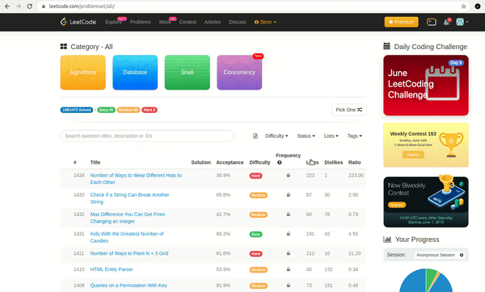

# About

Extension shows likes, dislikes, ratio(likes/dislikes) in front page and makes available sorting by them. For example, you can sort medium questions with tag "dynamic-programming".

       

## Installation

##### Chrome web store:
Go [here](https://chrome.google.com/webstore/detail/leetcodeextension/cjhcgcdnofphbmnofhdalemnpddbfphk) and click download.
##### From source:
#
    1.git clone --recursive https://github.com/yerlantemir/leetcoder
    2.Go to "chrome://extensions", load-unpacked and select installed repository
## Development

Want to contribute? Great!
1. Read official [tutorial](https://developer.chrome.com/extensions/getstarted#:~:text=The%20directory%20holding%20the%20manifest,More%20Tools%20then%20selecting%20Extensions.) to understand how it works.
2. Install project from source.
3. Create your Feature Branch (`git checkout -b feature/AmazingFeature`)
4. Commit your Changes (`git commit -m 'Add some AmazingFeature'`)
5. Push to the Branch (`git push origin feature/AmazingFeature`)
6. Open a Pull Request

## Todos

 - Write tests with python + selenium.
 - Find a way to divide a logic of popup window and content script.
 - Add radio buttons to popup window for dynamically turning on/off additional columns.

## Help, feedback or suggestions?

Feel free to contact me on [Telegram](https://t.me/YerlanTemir) for discussions, news & announcements about **leetcoder** & other projects.

